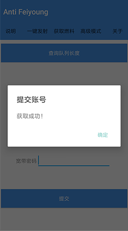
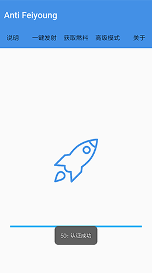

# Anti Feiyoung

----------

## 赞助

> 开发一个优秀的项目，离不开大量时间精力和资源的投入。
如果此项目给你带来了帮助，欢迎赞助,`Younntone`。
谢谢！

## 使用前须知
- 授予`Anti Feiyoung`悬浮窗权限
- 请确认宽带账号密码`（非WiFi密码）`无误后再点击提交，避免后台资源浪费
- 点击提交前请关闭无网络WiFi,使用数据提交`宽带账号密码`

## 使用说明
- 点击获取燃料- 填写`宽带账号密码`
- 点击一键发射小火箭

## 图文操作

1. 提交账号，提示`获取成功`即可发射火箭
2. 再连接`路由器WiFi`，点击一键发射小火箭，提示`认证成功`即可联网

 
 

## 版本发布
以微云文件夹形式发布，前往选择最新版本[下载](https://share.weiyun.com/5Zg68Nc)

## 关于
1. 本软件仅供测试使用
2. 本软件由Younntone公益开发，如果你通过购买获得，说明你被坑了！
3. 本软件不提供任何使用保障，有建议或者BUG反馈可以发[邮件](mailto:1580803953@qq.com)给开发者。
